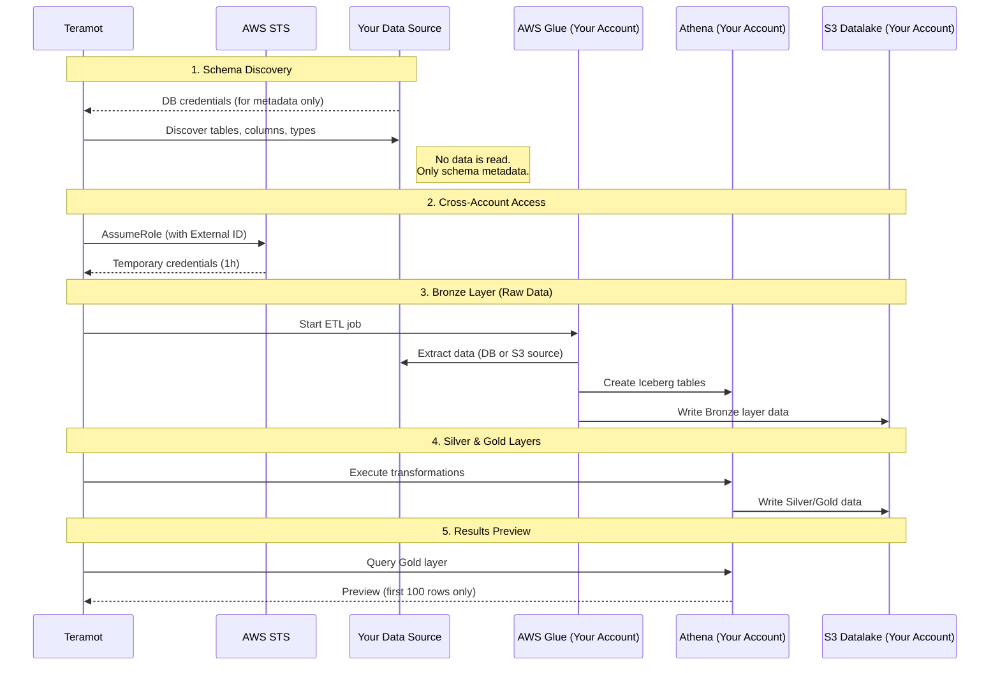
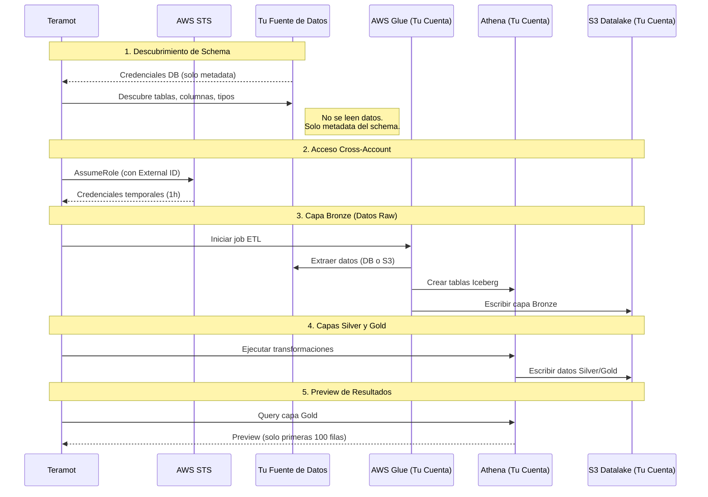

import Tabs from '@theme/Tabs';
import TabItem from '@theme/TabItem';

# Multi-Tenant Deployment

<Tabs groupId="lang" defaultValue="en" values={[
  {label: '🇺🇸 English', value: 'en'},
  {label: '🇪🇸 Español', value: 'es'},
]}>

<TabItem value="en">

Keep your data in your AWS account while leveraging Teramot's ETL automation.

## Overview

Teramot offers a **hybrid deployment model** where:
- **Your data stays 100% in your AWS account**
- **Orchestration is performed remotely by Teramot**

This approach ensures you maintain full control and ownership of your data.

---

## Data Flow




### Key Points

| Stage | Where it runs | What Teramot sees |
|-------|---------------|-------------------|
| Schema Discovery | Your infrastructure | Table/column names only |
| Data Extraction | **Your AWS** (Glue) | Job status |
| Transformations | **Your AWS** (Athena) | Query status |
| Data Storage | **Your AWS** (S3) | Nothing |
| Gold Results | **Your AWS** (Athena) | **Preview: first 100 rows only** |

---

## Resources Deployed in Your Account

### S3 Buckets

| Bucket | Purpose |
|--------|---------|
| `teramot-{tenant}-datalake` | Bronze/Silver/Gold layers (Iceberg format) |
| `teramot-{tenant}-data` | Your raw source files (CSV, Parquet, etc.) |
| `teramot-{tenant}-etl-scripts` | Glue job scripts |
| `teramot-{tenant}-athena-results` | Athena query results (auto-expire 30 days) |

### IAM Roles

| Role | Purpose |
|------|---------|
| `teramot-{tenant}-orchestrator-access` | Allows Teramot to assume cross-account role |
| `teramot-{tenant}-glue-execution-role` | Runs Glue jobs within your account |

### Other Resources

| Resource | Name |
|----------|------|
| Athena Workgroup | `teramot-{tenant}-workgroup` |
| Glue Databases | `{tenant}_*` (e.g., `acme_sales`) |

---

## Requirements

### 1. Data Source Access

**For Database Sources:**
- Teramot needs **read-only credentials** to discover schema (tables, columns, data types)
- These credentials are used to connect during schema discovery
- Glue jobs use these same credentials to extract data

:::note
During schema discovery, Teramot only reads metadata (table names, column names, data types). No actual data is read at this stage.
:::

**For S3 Sources:**
- Upload your files to the `teramot-{tenant}-data` bucket

### 2. IAM User for Infrastructure Deployment

We need an IAM user with the following permissions to deploy the required resources:

```json
{
  "Version": "2012-10-17",
  "Statement": [
    {
      "Sid": "S3BucketManagement",
      "Effect": "Allow",
      "Action": [
        "s3:CreateBucket",
        "s3:DeleteBucket",
        "s3:PutBucketVersioning",
        "s3:PutBucketEncryption",
        "s3:PutBucketPublicAccessBlock",
        "s3:PutLifecycleConfiguration",
        "s3:GetBucket*",
        "s3:ListBucket"
      ],
      "Resource": "arn:aws:s3:::teramot-*"
    },
    {
      "Sid": "IAMRoleManagement",
      "Effect": "Allow",
      "Action": [
        "iam:CreateRole",
        "iam:DeleteRole",
        "iam:GetRole",
        "iam:PutRolePolicy",
        "iam:DeleteRolePolicy",
        "iam:AttachRolePolicy",
        "iam:DetachRolePolicy",
        "iam:PassRole",
        "iam:TagRole",
        "iam:UntagRole"
      ],
      "Resource": "arn:aws:iam::*:role/teramot-*"
    },
    {
      "Sid": "AthenaWorkgroupManagement",
      "Effect": "Allow",
      "Action": [
        "athena:CreateWorkGroup",
        "athena:DeleteWorkGroup",
        "athena:UpdateWorkGroup",
        "athena:GetWorkGroup",
        "athena:TagResource"
      ],
      "Resource": "arn:aws:athena:*:*:workgroup/teramot-*"
    }
  ]
}
```

### 3. Information We Need

| Item | Example | Description |
|------|---------|-------------|
| `tenant_name` | `acme-corp` | Unique identifier (lowercase, hyphens only) |
| `aws_account_id` | `123456789012` | Your AWS account ID |
| `region` | `us-east-1` | Where to deploy resources |

---

## Security

| Aspect | Implementation |
|--------|---------------|
| Cross-Account Access | STS AssumeRole with External ID |
| Encryption at Rest | S3 Server-Side Encryption (AES256 or KMS) |
| Public Access | Blocked on all buckets |
| Temporary Credentials | Maximum 1-hour duration |
| Least Privilege | Permissions scoped to `teramot-{tenant}-*` resources |
| Audit Trail | All actions logged in CloudTrail |

:::important
Each tenant receives a unique **External ID** for role assumption. This prevents unauthorized access and solves the "confused deputy" problem.
:::

---

## FAQ

**Does my data leave my AWS account?**  
No. All data processing (Glue jobs, Athena queries) runs inside your AWS account. Only metadata and job status information is exchanged with Teramot.

**What happens if I revoke access?**  
Teramot immediately loses the ability to operate. Your data remains intact in your account.

**Can I audit Teramot's actions?**  
Yes. AWS CloudTrail logs all actions performed by the orchestrator role.

**Does Teramot see my actual data?**  
Only during Gold layer previews, Teramot receives the first 100 rows of query results for display purposes. All other data remains exclusively in your account.

</TabItem>

<TabItem value="es">

Mantené tus datos en tu cuenta AWS mientras aprovechás la automatización ETL de Teramot.

## Resumen

Teramot ofrece un **modelo de despliegue híbrido** donde:
- **Tus datos permanecen 100% en tu cuenta AWS**
- **La orquestación se realiza remotamente por Teramot**

Este enfoque asegura que mantengas control total sobre tus datos.

---

## Flujo de Datos




### Puntos Clave

| Etapa | Dónde se ejecuta | Qué ve Teramot |
|-------|------------------|----------------|
| Descubrimiento de Schema | Tu infraestructura | Solo nombres de tablas/columnas |
| Extracción de Datos | **Tu AWS** (Glue) | Estado del job |
| Transformaciones | **Tu AWS** (Athena) | Estado del query |
| Almacenamiento | **Tu AWS** (S3) | Nada |
| Resultados Gold | **Tu AWS** (Athena) | **Preview: solo 100 filas** |

---

## Recursos Desplegados en Tu Cuenta

### Buckets S3

| Bucket | Propósito |
|--------|-----------|
| `teramot-{tenant}-datalake` | Capas Bronze/Silver/Gold (formato Iceberg) |
| `teramot-{tenant}-data` | Tus archivos fuente (CSV, Parquet, etc.) |
| `teramot-{tenant}-etl-scripts` | Scripts de Glue jobs |
| `teramot-{tenant}-athena-results` | Resultados de queries Athena (auto-expire 30 días) |

### Roles IAM

| Rol | Propósito |
|-----|-----------|
| `teramot-{tenant}-orchestrator-access` | Permite a Teramot asumir rol cross-account |
| `teramot-{tenant}-glue-execution-role` | Ejecuta Glue jobs dentro de tu cuenta |

### Otros Recursos

| Recurso | Nombre |
|---------|--------|
| Athena Workgroup | `teramot-{tenant}-workgroup` |
| Glue Databases | `{tenant}_*` (ej: `acme_sales`) |

---

## Requisitos

### 1. Acceso a la Fuente de Datos

**Para fuentes de Base de Datos:**
- Teramot necesita **credenciales de solo lectura** para descubrir el schema (tablas, columnas, tipos de datos)
- Estas credenciales se usan para conectar durante el descubrimiento de schema
- Los jobs de Glue usan las mismas credenciales para extraer datos

:::note
Durante el descubrimiento de schema, Teramot solo lee metadata (nombres de tablas, columnas, tipos de datos). No se leen datos en esta etapa.
:::

**Para fuentes S3:**
- Subí tus archivos al bucket `teramot-{tenant}-data`

### 2. Usuario IAM para Despliegue de Infraestructura

Necesitamos un usuario IAM con los siguientes permisos para desplegar los recursos requeridos:

```json
{
  "Version": "2012-10-17",
  "Statement": [
    {
      "Sid": "S3BucketManagement",
      "Effect": "Allow",
      "Action": [
        "s3:CreateBucket",
        "s3:DeleteBucket",
        "s3:PutBucketVersioning",
        "s3:PutBucketEncryption",
        "s3:PutBucketPublicAccessBlock",
        "s3:PutLifecycleConfiguration",
        "s3:GetBucket*",
        "s3:ListBucket"
      ],
      "Resource": "arn:aws:s3:::teramot-*"
    },
    {
      "Sid": "IAMRoleManagement",
      "Effect": "Allow",
      "Action": [
        "iam:CreateRole",
        "iam:DeleteRole",
        "iam:GetRole",
        "iam:PutRolePolicy",
        "iam:DeleteRolePolicy",
        "iam:AttachRolePolicy",
        "iam:DetachRolePolicy",
        "iam:PassRole",
        "iam:TagRole",
        "iam:UntagRole"
      ],
      "Resource": "arn:aws:iam::*:role/teramot-*"
    },
    {
      "Sid": "AthenaWorkgroupManagement",
      "Effect": "Allow",
      "Action": [
        "athena:CreateWorkGroup",
        "athena:DeleteWorkGroup",
        "athena:UpdateWorkGroup",
        "athena:GetWorkGroup",
        "athena:TagResource"
      ],
      "Resource": "arn:aws:athena:*:*:workgroup/teramot-*"
    }
  ]
}
```

### 3. Información que Necesitamos

| Dato | Ejemplo | Descripción |
|------|---------|-------------|
| `tenant_name` | `acme-corp` | Identificador único (minúsculas, solo guiones) |
| `aws_account_id` | `123456789012` | Tu AWS account ID |
| `region` | `us-east-1` | Dónde desplegar los recursos |

---

## Seguridad

| Aspecto | Implementación |
|---------|---------------|
| Acceso Cross-Account | STS AssumeRole con External ID |
| Encriptación en Reposo | S3 Server-Side Encryption (AES256 o KMS) |
| Acceso Público | Bloqueado en todos los buckets |
| Credenciales Temporales | Duración máxima 1 hora |
| Mínimo Privilegio | Permisos limitados a recursos `teramot-{tenant}-*` |
| Auditoría | Todas las acciones logueadas en CloudTrail |

:::important
Cada tenant recibe un **External ID único** para la asunción del rol. Esto previene accesos no autorizados y resuelve el problema del "confused deputy".
:::

## FAQ

**¿Mis datos salen de mi cuenta AWS?**  
No. Todo el procesamiento de datos (Glue jobs, queries Athena) corre dentro de tu cuenta AWS. Solo metadata e información de estado de jobs se intercambia con Teramot.

**¿Qué pasa si revoco el acceso?**  
Teramot pierde inmediatamente la capacidad de operar. Tus datos permanecen intactos en tu cuenta.

**¿Puedo auditar las acciones de Teramot?**  
Sí. AWS CloudTrail loguea todas las acciones realizadas por el rol del orquestador.

**¿Teramot ve mis datos reales?**  
Solo durante los previews de la capa Gold, Teramot recibe las primeras 100 filas de los resultados del query para mostrar. Todos los demás datos permanecen exclusivamente en tu cuenta.

</TabItem>

</Tabs>
